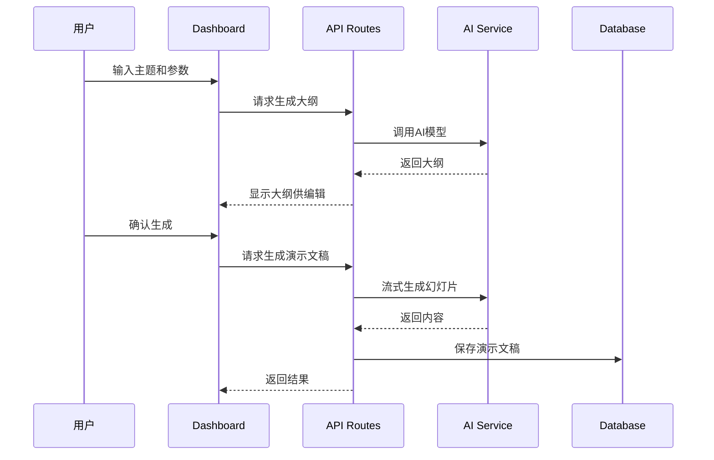

# Presentation AI - 项目架构记忆

## 项目概述
Presentation AI 是一个基于AI的演示文稿生成平台，使用Next.js 15 + React 19 + TypeScript构建。灵感来源于Gamma.app，支持AI驱动的内容生成、实时编辑和多主题定制。

## 核心技术栈

### 前端框架
- **Next.js**: 15.5.4 (App Router)
- **React**: 19.1.0
- **TypeScript**: 5.9.2
- **Tailwind CSS**: 3.4.17

### 数据库与ORM
- **PostgreSQL**: 主数据库
- **Prisma**: 6.13.0 ORM

### 认证与授权
- **NextAuth.js**: 5.0.0-beta.29 (Google OAuth)

### AI集成
- **OpenAI API**: GPT系列模型，文本生成
- **Together AI**: 图像生成
- **本地模型**: Ollama + LM Studio支持

### 编辑器组件
- **Plate.js**: 49.2.21 (基于Slate/ProseMirror的富文本编辑器)
- **DND Kit**: 拖拽功能
- **Radix UI**: 无障碍UI组件

### 文件处理
- **UploadThing**: 文件上传服务

## 核心模块架构

### 1. App模块 (src/app/)
Next.js App Router核心，包含：
- 应用路由和页面定义
- API端点实现
- Server Actions
- 全局布局配置

**关键API端点**:
- `/api/presentation/generate` - 演示文稿生成
- `/api/presentation/outline` - 大纲生成
- `/api/auth/[...nextauth]` - 认证处理

### 2. 组件模块 (src/components/)
- **presentation/**: 演示文稿相关UI组件
  - dashboard/: 仪表板组件
  - editor/: 编辑器组件
  - theme/: 主题组件
  - outline/: 大纲组件
- **plate/**: Plate编辑器配置和插件
- **ui/**: 通用UI组件

### 3. 数据模型 (Prisma)

**核心实体**:
- **User**: 用户管理，支持角色权限
- **BaseDocument**: 文档基类，支持多种文档类型
- **Presentation**: 演示文稿特化模型
- **CustomTheme**: 自定义主题系统
- **GeneratedImage**: AI生成图像管理

**关系结构**:
```
User 1:N BaseDocument 1:1 Presentation
User 1:N CustomTheme 1:N Presentation
User 1:N GeneratedImage
```

### 4. 服务端操作 (src/app/_actions/)
Server Actions处理服务端业务逻辑：
- 演示文稿CRUD操作
- 主题管理
- 图像生成
- 导出功能

## 核心数据流

### 演示文稿生成流程


### AI模型支持
- **OpenAI**: GPT-4等文本模型
- **Together AI**: 图像生成模型
- **本地模型**: 通过Ollama/LM Studio

## 开发脚本

```bash
# 开发相关
pnpm dev          # 启动开发服务器 (Turbo)
pnpm build        # 构建生产版本 (Turbo)
pnpm start        # 启动生产服务器
pnpm type         # TypeScript类型检查
pnpm lint         # 代码检查
pnpm lint:fix     # 自动修复代码问题
pnpm check        # 完整代码检查
pnpm check:fix    # 自动修复所有问题

# 数据库相关
pnpm db:push      # 推送schema更改
pnpm db:studio    # 打开Prisma Studio

# 依赖管理
pnpm install      # 安装依赖
pnpm postinstall  # 生成Prisma客户端
```

## 环境变量配置

必需的环境变量：
```env
# AI服务
OPENAI_API_KEY=""
TOGETHER_AI_API_KEY=""

# NextAuth
NEXTAUTH_SECRET=""
NEXTAUTH_URL="http://localhost:3000"
GOOGLE_CLIENT_ID=""
GOOGLE_CLIENT_SECRET=""

# 文件服务
UPLOADTHING_TOKEN=""
UNSLPASH_ACCESS_KEY=""

# 数据库
DATABASE_URL="postgresql://..."
```

## 测试状态
**当前状态**: 项目缺少测试覆盖

**建议测试框架**:
- Jest + React Testing Library (单元测试)
- Playwright (E2E测试)
- Supertest (API测试)

## 已知问题和改进点

1. **测试覆盖**: 需要完整的测试套件
2. **移动端适配**: 需要改进移动端体验  
3. **性能优化**: 可添加缓存和查询优化
4. **错误处理**: 需要更完善的错误边界
5. **文档完善**: API文档和组件文档需要补充

## 扩展功能路线图
- [ ] 导出PDF功能
- [ ] 实时协作
- [ ] 模板库
- [ ] 动画和过渡效果
- [ ] 多语言支持
- [ ] 插件系统

## 开发注意事项

1. **代码规范**: 使用Biome进行代码格式化和检查
2. **类型安全**: TypeScript严格模式
3. **安全性**: API密钥不提交到版本控制
4. **性能**: 使用流式响应处理AI生成内容
5. **可维护性**: 遵循现有目录结构和命名约定