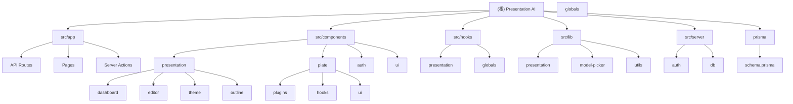
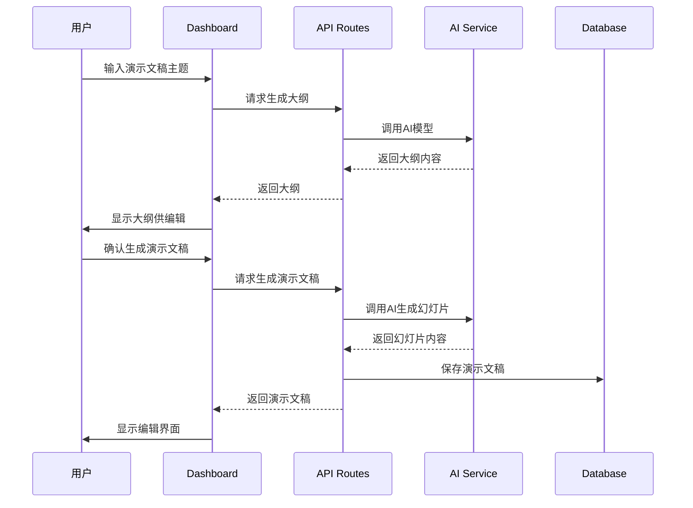

# Presentation AI - AI驱动演示文稿生成系统

## 变更记录 (Changelog)

**2025-11-17 23:56:24** - 初始化架构扫描，完成75%覆盖率分析
- 识别8个核心模块
- 发现完整的演示文稿生成流程
- 识别测试和文档缺口

## 项目愿景

Presentation AI 是一个基于AI的演示文稿生成平台，灵感来源于Gamma.app。用户可以通过简单的描述快速生成专业、美观的演示文稿，支持多种主题、实时编辑和导出功能。

## 架构总览

### 技术栈
- **前端**: Next.js 15.5.4 + React 19.1.0 + TypeScript + Tailwind CSS
- **后端**: Next.js API Routes + Prisma ORM + PostgreSQL
- **认证**: NextAuth.js (Google OAuth)
- **编辑器**: Plate.js (基于Slate/ProseMirror)
- **AI集成**: OpenAI API + Together AI + 本地模型支持(Ollama/LM Studio)
- **UI组件**: Radix UI + Lucide React + Framer Motion
- **文件处理**: UploadThing

### 核心功能
- AI驱动的内容生成和演示文稿创建
- 实时编辑和预览
- 自定义主题系统
- 多种布局元素和图表支持
- 图像生成和集成
- 演示模式
- 导出功能(PPTX开发中)

## 模块结构图



## 模块索引

| 模块路径 | 类型 | 职责描述 | 覆盖率 |
|---------|------|----------|--------|
| `src/app` | Next.js App Router | 应用路由、API端点、服务端操作 | 高 |
| `src/components/presentation` | React组件 | 演示文稿UI组件，包含仪表板和编辑器 | 高 |
| `src/components/plate` | 编辑器组件 | Plate.js富文本编辑器配置和插件 | 中 |
| `src/app/_actions` | Server Actions | 服务端操作函数，处理CRUD操作 | 中 |
| `src/hooks` | React Hooks | 自定义钩子，状态管理和副作用 | 中 |
| `src/lib` | 工具库 | 共享工具函数、配置和业务逻辑 | 低 |
| `src/server` | 服务端配置 | 数据库连接和认证配置 | 低 |
| `prisma` | 数据库 | 数据模型定义和数据库操作 | 高 |

## 核心数据流



## 运行与开发

### 环境要求
- Node.js 18.x+
- PostgreSQL 数据库
- 必需的API密钥(OpenAI, Together AI, Google OAuth等)

### 开发脚本
```bash
# 安装依赖
pnpm install

# 数据库初始化
pnpm db:push

# 启动开发服务器
pnpm dev

# 构建生产版本
pnpm build

# 类型检查
pnpm type

# 代码检查
pnpm lint
```

### 环境变量配置
参考 `.env.example` 文件，配置以下关键变量：
- `DATABASE_URL`: PostgreSQL数据库连接
- `OPENAI_API_KEY`: OpenAI API密钥
- `TOGETHER_AI_API_KEY`: Together AI API密钥
- `GOOGLE_CLIENT_ID/SECRET`: Google OAuth配置
- `NEXTAUTH_SECRET`: NextAuth密钥

## 测试策略

**当前状态**: 缺失测试覆盖

**建议的测试策略**:
1. **单元测试**: 为工具函数和hooks添加测试
2. **集成测试**: 测试API端点和数据库操作
3. **组件测试**: 使用React Testing Library测试关键组件
4. **E2E测试**: 使用Playwright测试完整的用户流程

**推荐测试框架**: Jest + React Testing Library + Playwright

## 编码规范

### 代码风格
- 使用 **Biome** 进行代码格式化和检查
- TypeScript 严格模式
- ESLint + Prettier 配置

### 命名约定
- 组件: PascalCase (例: `PresentationDashboard`)
- 文件名: kebab-case (例: `presentation-dashboard.tsx`)
- 函数/变量: camelCase
- 常量: UPPER_SNAKE_CASE

### 目录结构规范
```
src/
├── app/                 # Next.js App Router
│   ├── api/            # API路由
│   ├── _actions/       # Server Actions
│   └── (pages)/        # 页面组件
├── components/         # React组件
│   ├── presentation/   # 演示文稿相关组件
│   ├── plate/         # 编辑器组件
│   └── ui/            # 通用UI组件
├── hooks/             # 自定义React钩子
├── lib/               # 工具函数和配置
└── server/            # 服务端配置
```

## AI使用指引

### 支持的AI模型
- **OpenAI**: GPT系列模型用于文本生成
- **Together AI**: 图像生成模型
- **本地模型**: 支持Ollama和LM Studio

### AI功能
1. **演示文稿大纲生成**: 基于用户输入生成结构化大纲
2. **幻灯片内容生成**: 根据大纲生成详细幻灯片内容
3. **图像生成**: 为幻灯片生成相关图像
4. **网络搜索集成**: 使用Tavily API获取最新信息

### 开发AI功能注意事项
- 确保API密钥安全存储
- 实现适当的错误处理和重试机制
- 考虑模型响应时间和成本
- 实现流式响应以提升用户体验

## 部署建议

### 生产环境
- 推荐使用 Vercel 或 Railway
- 配置 PostgreSQL 数据库
- 设置环境变量
- 配置域名和SSL

### Docker部署
项目支持Docker部署，注意以下几点：
- 使用多阶段构建优化镜像大小
- 正确设置环境变量
- 数据库连接配置

## 性能优化建议

1. **代码分割**: 使用动态导入优化Bundle大小
2. **图片优化**: 使用Next.js Image组件
3. **数据库优化**: 添加适当的索引
4. **缓存策略**: 实现API响应缓存
5. **CDN**: 使用CDN加速静态资源

## 安全考虑

- API密钥不提交到版本控制
- 实现适当的身份验证和授权
- 输入验证和清理
- 限制API调用频率
- 安全的文件上传处理

## 贡献指南

1. Fork项目
2. 创建功能分支
3. 编写代码和测试
4. 提交PR
5. 代码审查和合并

## 已知问题和改进点

1. **测试覆盖**: 当前缺少完整的测试套件
2. **错误处理**: 需要更完善的错误边界
3. **移动端适配**: 需要改进移动端体验
4. **性能监控**: 需要添加性能监控
5. **文档完善**: 需要API文档和组件文档

## 扩展功能路线图

- [ ] 导出PDF功能
- [ ] 实时协作
- [ ] 模板库
- [ ] 动画和过渡效果
- [ ] 多语言支持
- [ ] 插件系统
- [ ] API开放平台