<!-- OPENSPEC:START -->
# OpenSpec Instructions

These instructions are for AI assistants working in this project.

Always open `@/openspec/AGENTS.md` when the request:
- Mentions planning or proposals (words like proposal, spec, change, plan)
- Introduces new capabilities, breaking changes, architecture shifts, or big performance/security work
- Sounds ambiguous and you need the authoritative spec before coding

Use `@/openspec/AGENTS.md` to learn:
- How to create and apply change proposals
- Spec format and conventions
- Project structure and guidelines

Keep this managed block so 'openspec update' can refresh the instructions.

<!-- OPENSPEC:END -->

# Presentation AI - AI驱动演示文稿生成系统

## 变更记录 (Changelog)

**2025-11-28** - 全面文档更新，补充缺失模块和技术栈
- 补充 provider、states、styles、prose-mirror 模块文档
- 更新完整技术栈：状态管理、动画库、图表库、AI工具链
- 补充数据模型：CustomTheme、FavoriteDocument、GeneratedImage
- 更新依赖版本：React 19.1.0、Next.js 15.5.4、pnpm 10.17.0

**2025-11-17 23:56:24** - 初始化架构扫描，完成75%覆盖率分析
- 识别8个核心模块
- 发现完整的演示文稿生成流程
- 识别测试和文档缺口

## 项目愿景

Presentation AI 是一个基于AI的演示文稿生成平台，灵感来源于Gamma.app。用户可以通过简单的描述快速生成专业、美观的演示文稿，支持多种主题、实时编辑和导出功能。

## 架构总览

### 技术栈
- **包管理器**: pnpm 10.17.0
- **前端**: Next.js 15.5.4 + React 19.1.0 + TypeScript + Tailwind CSS
- **后端**: Next.js API Routes + Prisma ORM + PostgreSQL
- **认证**: NextAuth.js 5.0.0-beta.29 (Google OAuth)
- **状态管理**: Zustand 4.5.7 + TanStack Query 5.84.2
- **编辑器**: Plate.js 49.x (富文本) + ProseMirror (大纲编辑)
- **AI工具链**: LangChain 0.3.30 + DeepSeek/OpenAI + Together AI
- **动画**: Framer Motion 11.18.2
- **图表**: Recharts 2.15.4
- **网络搜索**: Tavily API 0.5.12
- **UI组件**: Radix UI + Lucide React
- **文件处理**: UploadThing
- **导出**: pptxgenjs 4.0.1

### 核心功能
- AI驱动的内容生成和演示文稿创建
- 实时编辑和预览
- 自定义主题系统
- 多种布局元素和图表支持
- 图像生成和集成
- 演示模式
- 收藏功能 - 用户可收藏演示文稿
- 图像生成历史 - 记录所有AI生成的图像
- 自定义主题管理 - 创建、保存和分享自定义主题
- 网络搜索增强 - 使用Tavily API获取实时信息
- 导出功能(PPTX支持)

## 模块结构图

```mermaid
graph TD
    A["(根) Presentation AI"] --> B["src/app"];
    A --> C["src/components"];
    A --> D["src/hooks"];
    A --> E["src/lib"];
    A --> F["src/provider"];
    A --> G["src/states"];
    A --> H["src/styles"];
    A --> I["src/server"];
    A --> J["prisma"];

    B --> B1["API Routes"];
    B --> B2["Pages"];
    B --> B3["Server Actions"];

    C --> C1["presentation"];
    C --> C2["plate"];
    C --> C3["prose-mirror"];
    C --> C4["auth"];
    C --> C5["ui"];
    C6["globals"];

    C1 --> C1A["dashboard"];
    C1 --> C1B["editor"];
    C1 --> C1C["theme"];
    C1 --> C1D["outline"];

    C2 --> C2A["plugins"];
    C2 --> C2B["hooks"];
    C2 --> C2C["ui"];

    C3 --> C3A["ProseMirrorEditor"];
    C3 --> C3B["FloatingToolbar"];
    C3 --> C3C["ProseMirrorSchema"];

    F --> F1["NextAuthProvider"];
    F --> F2["TanstackProvider"];
    F --> F3["theme-provider"];

    G --> G1["presentation-state"];

    H --> H1["globals.css"];
    H --> H2["presentation.css"];

    D --> D1["presentation"];
    D --> D2["globals"];

    E --> E1["presentation"];
    E --> E2["model-picker"];
    E --> E3["utils"];

    I --> I1["auth"];
    I --> I2["db"];

    J --> J1["schema.prisma"];

    click B "./src/app/CLAUDE.md" "查看应用模块文档"
    click C "./src/components/CLAUDE.md" "查看组件模块文档"
    click D "./src/hooks/CLAUDE.md" "查看钩子模块文档"
    click E "./src/lib/CLAUDE.md" "查看工具库文档"
    click F "./src/provider/CLAUDE.md" "查看Provider模块文档"
    click G "./src/states/CLAUDE.md" "查看状态管理文档"
    click H "./src/styles/CLAUDE.md" "查看样式模块文档"
    click I "./src/server/CLAUDE.md" "查看服务端文档"
    click J "./prisma/CLAUDE.md" "查看数据库文档"
```



## 模块索引

| 模块路径 | 类型 | 职责描述 | 覆盖率 |
|---------|------|----------|--------|
| `src/app` | Next.js App Router | 应用路由、API端点、服务端操作 | 高 |
| `src/components/presentation` | React组件 | 演示文稿UI组件，包含仪表板和编辑器 | 高 |
| `src/components/plate` | 编辑器组件 | Plate.js富文本编辑器配置和插件 | 中 |
| `src/components/prose-mirror` | 编辑器组件 | ProseMirror大纲编辑器 | 中 |
| `src/provider` | React Context | 应用级Provider（认证、查询、主题） | 中 |
| `src/states` | 状态管理 | Zustand全局状态管理 | 低 |
| `src/styles` | 样式文件 | 全局样式和CSS模块 | 低 |
| `src/app/_actions` | Server Actions | 服务端操作函数，处理CRUD操作 | 中 |
| `src/hooks` | React Hooks | 自定义钩子，状态管理和副作用 | 中 |
| `src/lib` | 工具库 | 共享工具函数、配置和业务逻辑 | 低 |
| `src/server` | 服务端配置 | 数据库连接和认证配置 | 低 |
| `prisma` | 数据库 | 数据模型定义和数据库操作 | 高 |

## 核心数据流


## 运行与开发

### 环境要求
- Node.js 18.x+
- PostgreSQL 数据库
- 必需的API密钥(OpenAI, Together AI, Google OAuth等)

### 开发脚本
```bash
# 安装依赖
pnpm install

# 数据库初始化
pnpm db:push

# 启动开发服务器
pnpm dev

# 构建生产版本
pnpm build

# 类型检查
pnpm type

# 代码检查
pnpm lint
```

### 环境变量配置
参考 `.env.example` 文件，配置以下关键变量：
- `DATABASE_URL`: PostgreSQL数据库连接
- `DEEPSEEK_API_KEY`: DeepSeek API密钥 (主要AI服务提供商)
- `OPENAI_API_KEY`: OpenAI API密钥 (可选fallback)
- `TOGETHER_AI_API_KEY`: Together AI API密钥
- `GOOGLE_CLIENT_ID/SECRET`: Google OAuth配置
- `NEXTAUTH_SECRET`: NextAuth密钥
- `UNSPLASH_ACCESS_KEY`: Unsplash图片API密钥
- `TAVILY_API_KEY`: Tavily网络搜索API密钥

## 测试策略

**当前状态**: 缺失测试覆盖

**建议的测试策略**:
1. **单元测试**: 为工具函数和hooks添加测试
2. **集成测试**: 测试API端点和数据库操作
3. **组件测试**: 使用React Testing Library测试关键组件
4. **E2E测试**: 使用Playwright测试完整的用户流程

**推荐测试框架**: Jest + React Testing Library + Playwright

## 编码规范

### 代码风格
- 使用 **Biome** 进行代码格式化和检查
- TypeScript 严格模式
- ESLint + Prettier 配置

### 命名约定
- 组件: PascalCase (例: `PresentationDashboard`)
- 文件名: kebab-case (例: `presentation-dashboard.tsx`)
- 函数/变量: camelCase
- 常量: UPPER_SNAKE_CASE

### 目录结构规范
```
src/
├── app/                 # Next.js App Router
│   ├── api/            # API路由
│   ├── _actions/       # Server Actions
│   └── (pages)/        # 页面组件
├── components/         # React组件
│   ├── presentation/   # 演示文稿相关组件
│   ├── plate/         # Plate.js编辑器组件
│   ├── prose-mirror/  # ProseMirror大纲编辑器
│   └── ui/            # 通用UI组件
├── provider/           # React Context Providers
│   ├── NextAuthProvider.tsx
│   ├── TanstackProvider.tsx
│   └── theme-provider.tsx
├── states/             # Zustand状态管理
│   └── presentation-state.ts
├── styles/             # 全局样式
│   ├── globals.css
│   └── presentation.css
├── hooks/             # 自定义React钩子
├── lib/               # 工具函数和配置
└── server/            # 服务端配置
```

## AI使用指引

### 支持的AI模型
- **DeepSeek** (默认): DeepSeek Chat和DeepSeek Reasoner模型，提供高质量的文本生成和推理能力
- **OpenAI** (备用): GPT系列模型作为fallback选项
- **Together AI**: 图像生成模型
- **本地模型**: 支持Ollama和LM Studio

### AI功能
1. **演示文稿大纲生成**: 基于用户输入生成结构化大纲
2. **幻灯片内容生成**: 根据大纲生成详细幻灯片内容
3. **图像生成**: 为幻灯片生成相关图像
4. **网络搜索集成**: 使用Tavily API获取最新信息
5. **思考过程提取**: 配合DeepSeek Reasoner等推理模型提取思考过程

### 开发AI功能注意事项
- 确保API密钥安全存储 (DEEPSEEK_API_KEY为必需)
- 实现适当的错误处理和重试机制 (已内置指数退避重试)
- 考虑模型响应时间和成本 (DeepSeek成本更低，响应速度优异)
- 实现流式响应以提升用户体验 (支持OpenAI兼容格式)

## 部署建议

### 生产环境
- 推荐使用 Vercel 或 Railway
- 配置 PostgreSQL 数据库
- 设置环境变量 (必须包含 DEEPSEEK_API_KEY)
- 配置域名和SSL

### Docker部署
项目支持Docker部署，注意以下几点：
- 使用多阶段构建优化镜像大小
- 正确设置环境变量
- 数据库连接配置

## 性能优化建议

1. **代码分割**: 使用动态导入优化Bundle大小
2. **图片优化**: 使用Next.js Image组件
3. **数据库优化**: 添加适当的索引
4. **缓存策略**: 实现API响应缓存
5. **CDN**: 使用CDN加速静态资源

## 安全考虑

- API密钥不提交到版本控制
- 实现适当的身份验证和授权
- 输入验证和清理
- 限制API调用频率
- 安全的文件上传处理

## 贡献指南

1. Fork项目
2. 创建功能分支
3. 编写代码和测试
4. 提交PR
5. 代码审查和合并

## 已知问题和改进点

1. **测试覆盖**: 当前缺少完整的测试套件
2. **错误处理**: 需要更完善的错误边界
3. **移动端适配**: 需要改进移动端体验
4. **性能监控**: 需要添加性能监控
5. **文档完善**: 需要API文档和组件文档

## 扩展功能路线图

- [x] 导出PPTX功能 (已实现pptxgenjs集成)
- [ ] 导出PDF功能
- [ ] 实时协作
- [ ] 模板库
- [ ] 动画和过渡效果
- [ ] 多语言支持
- [ ] 插件系统
- [ ] API开放平台

---

## 文档生成时间

**最后更新**: 2025-11-28
**扫描覆盖率**: ~90% (主要源代码目录)
**验证状态**: ✅ 已验证项目结构和依赖关系