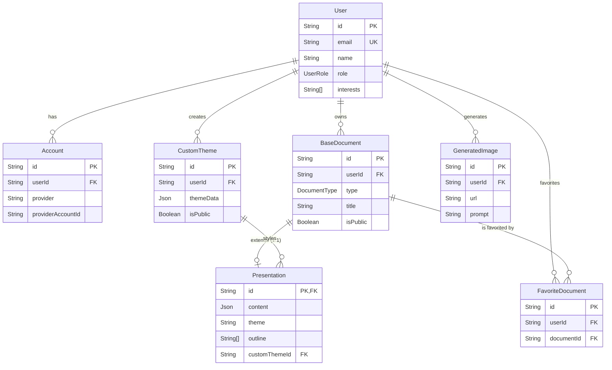
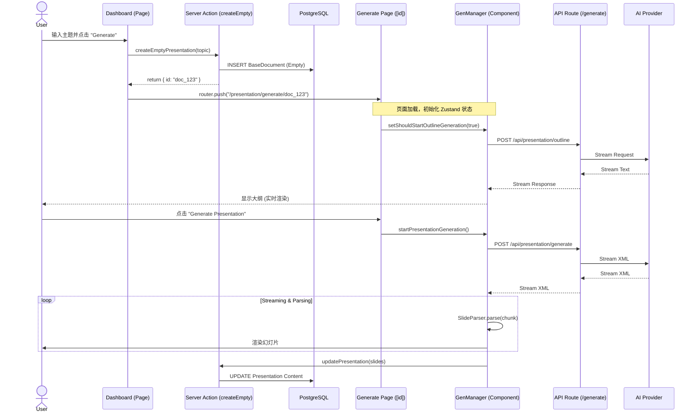

# 系统架构与维护指南 (System Architecture and Maintenance Guide)

> [!IMPORTANT]
> **执行摘要 (Executive Summary)**
> 本项目是一个基于 **Next.js (App Router)**, **Prisma (PostgreSQL)**, 和 **Tailwind CSS** 的全栈 AI 演示文稿生成应用。
> - **架构现状**: 典型的 T3 Stack 架构，前后端紧密耦合。主要业务逻辑集中在 Server Actions 和 Frontend Components (`PresentationGenerationManager`) 中。
> - **核心风险**: API 输入缺乏运行时验证 (Zod)，存在脏数据入库风险；前端图片生成逻辑存在 N+1 并发请求风险。
> - **维护建议**: 优先引入 Zod Schema 强化 API 契约，并优化前端的并发请求逻辑。

## 1. 💾 数据库与数据模型透视 (The Data Truth)

### 1.1 实体关系图 (ER Diagram)

### 1.2 诊断报告

#### 类型兼容性与安全性
- **JSON 字段**: `Presentation.content`, `Presentation.searchResults`, `CustomTheme.themeData` 使用了 `Json` 类型。在 PostgreSQL 中这通常映射为 `JSONB`，性能良好。但应用层需要 Zod Schema 来严格验证这些 JSON 的结构，否则容易导致运行时错误。
- **数组字段**: `User.interests` 和 `Presentation.outline` 使用了 `String[]`。这是 PostgreSQL 的特有功能，迁移到其他数据库（如 MySQL/SQLite）时可能会有问题。
- **枚举**: `UserRole` 和 `DocumentType` 使用了原生 Enum。

#### 冗余与潜在混淆
- **`BaseDocument`**: 存在 `type` (Enum `DocumentType`) 和 `documentType` (String) 两个字段。
    - `type` 似乎是核心分类（如 `PRESENTATION`, `NOTE`）。
    - `documentType` 用途不明，可能是遗留字段或用于更细粒度的前端路由，存在数据不一致风险。

#### 索引与约束建议
- **外键索引**: Prisma 在 PostgreSQL 中通常会自动为外键创建隐式索引，但显式定义索引有助于性能调优和文档化。
    - `CustomTheme` 显式定义了 `@@index([userId])`，这很好。
    - 建议为 `BaseDocument(userId)`, `FavoriteDocument(userId)`, `GeneratedImage(userId)` 添加显式索引，因为按用户查询文档是高频操作。
- **级联删除**:
    - `User` 删除会级联删除 `Account`, `CustomTheme`, `GeneratedImage` (Good)。
    - `User` 删除**不会**级联删除 `BaseDocument` (默认行为是 Restrict 还是 SetNull 需要确认 Prisma 默认行为，通常需要显式指定 `onDelete`)。检查 Schema 发现 `BaseDocument` 的 `user` 关联**没有** `onDelete: Cascade`。这意味着如果尝试删除一个有文档的用户，可能会报错。建议添加 `onDelete: Cascade`。
    - `Presentation` 删除会级联删除 `BaseDocument`? 不，`Presentation` 是 `BaseDocument` 的扩展。`Presentation` 定义了 `base BaseDocument @relation(fields: [id], references: [id], onDelete: Cascade)`。这意味着删除 `BaseDocument` 会自动删除 `Presentation`。这是正确的。

#### 必填字段检查
- `Presentation.content` 是必填的 `Json`。
- `Presentation.theme` 有默认值 "default"。
- `BaseDocument.title` 是必填的。
- 核心业务字段定义较为严谨。

## 2. 🔌 API 契约审计 (The API Contract)

### 2.1 概览
项目主要使用 **Server Actions** 处理数据变更，使用 **API Routes** 处理流式响应（如 AI 生成）。

| API 路径 / Action | 类型 | 输入定义 (TS) | 运行时验证 (Zod) | 风险等级 |
| :--- | :--- | :--- | :--- | :--- |
| `createPresentation` | Server Action | `{ content: { slides: PlateSlide[] }, ... }` | ❌ 无 (强制类型转换) | 🔴 高 |
| `updatePresentation` | Server Action | `{ content?: ..., searchResults?: ... }` | ❌ 无 (强制类型转换) | 🔴 高 |
| `generateImageAction` | Server Action | `prompt: string, model: Enum` | ❌ 无 (仅默认值) | 🟡 中 |
| `/api/presentation/generate` | API Route | `SlidesRequest` Interface | ⚠️ 部分 (手动检查字段存在性) | 🟡 中 |

### 2.2 核心风险点
1.  **缺乏运行时校验**: Server Actions 严重依赖 TypeScript 的静态类型检查。在运行时，`content` 等复杂对象被直接断言为 `InputJsonValue` 并存入数据库。如果前端传递了不符合 `PlateSlide` 结构的数据，后端不会拦截，导致脏数据入库，可能在读取时导致前端组件崩溃。
2.  **类型断言滥用**: 代码中频繁出现 `as unknown as InputJsonValue`。这绕过了 Prisma 的类型安全检查。
3.  **API Route 脆弱性**: `/api/presentation/generate` 虽然检查了 `outline` 是否为数组，但未检查 `searchResults` 等嵌套对象的结构。如果第三方服务返回了非预期格式，API 可能会抛出 500 错误。

### 2.3 改进建议
- 引入 `zod` 或 `valibot` 为所有 Server Actions 和 API Routes 定义严格的 Schema。
- 在 `createPresentation` 和 `updatePresentation` 中，使用 Zod Schema 验证 `content` 的 JSON 结构，确保其符合 `PlateSlide[]` 的定义。
- 移除 `as unknown as` 强制转换，改用类型安全的转换函数。

## 3. 🌊 核心业务链路还原 (Critical User Flows)

### 3.1 演示文稿生成链路 (Presentation Generation Flow)

此流程涉及前端状态管理、Server Actions 和流式 API 的紧密配合。

### 3.2 痛点与风险分析
1.  **状态管理复杂性**: 整个流程高度依赖 `PresentationGenerationManager` 组件（挂载在 `layout.tsx`）和 Zustand Store。如果用户在生成过程中刷新页面，虽然 `[id]/page.tsx` 会尝试从 DB 恢复状态，但正在进行的流式请求会中断，导致生成不完整。
2.  **僵尸生成 (Zombie Generation)**: 如果用户关闭标签页，后端 API 的流式生成可能不会立即终止（取决于 AI SDK 的处理），造成 Token 浪费。
3.  **数据一致性**: `createEmptyPresentation` 创建了一个空壳文档。如果用户在生成大纲前离开，数据库中会残留大量标题为 "Untitled" 的空文档。
4.  **XML 解析脆弱性**: 前端依赖正则表达式和自定义解析器 (`SlideParser`) 处理 AI 返回的 XML。如果 AI 生成了畸形的 XML 标签，解析器可能会抛出异常导致整个生成流程崩溃。

## 4. 💀 僵尸代码与技术债 (Code Hygiene)

### 4.1 敏感信息扫描
- ✅ 未发现硬编码的 `sk-` 开头密钥。
- ✅ 环境变量通过 `src/env.js` 和 `t3-oss/env-nextjs` 进行管理，安全性较好。

### 4.2 性能隐患 (N+1 问题)
- **位置**: `src/components/presentation/dashboard/PresentationGenerationManager.tsx` (Line 106-171)
- **问题**: 在 `updateSlidesWithRAF` 中，代码遍历所有幻灯片，并为每个缺少图片的幻灯片触发 `generateImageAction`。
- **风险**: 如果生成的演示文稿有 10 张幻灯片，这将并发触发 10 个 Server Action 调用，每个调用都可能建立新的数据库连接。这会导致数据库连接池耗尽，并可能触发 AI 提供商的速率限制 (Rate Limit)。
- **建议**: 实现批量生成接口，或在前端使用队列限制并发数。

### 4.3 遗留标记 (TODOs)
- `src/app/api/presentation/generate/route.ts`: "TODO: Add table and chart to the available layouts" - 提示目前的生成模版功能不完整。

## 5. 🚀 维护建议总结
1.  **当务之急**: 为 `createPresentation` 和 `updatePresentation` 添加 Zod 验证，防止脏数据入库。
2.  **短期优化**: 优化 `PresentationGenerationManager` 中的图片生成逻辑，避免并发风暴。
3.  **长期规划**: 考虑将 XML 解析逻辑移至后端，或使用更健壮的解析库，减少前端崩溃风险。
