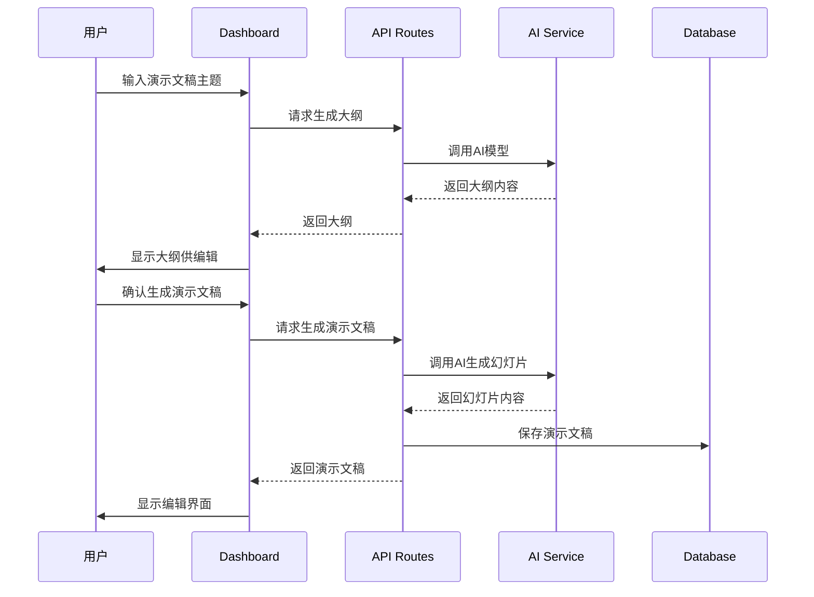

# Project Context

## Purpose
Presentation AI 是一个基于AI的演示文稿生成平台，灵感来源于Gamma.app。用户可以通过简单的描述快速生成专业、美观的演示文稿，支持多种主题、实时编辑和导出功能。

## Tech Stack

### 前端框架
- **Next.js**: 15.5.4 (App Router)
- **React**: 19.1.0
- **TypeScript**: 5.9.2
- **Tailwind CSS**: 3.4.17

### 数据库与ORM
- **PostgreSQL**: 主数据库
- **Prisma**: 6.13.0 ORM

### 认证与授权
- **NextAuth.js**: 5.0.0-beta.29 (Google OAuth)

### AI集成
- **DeepSeek**: (默认) Chat和Reasoner模型，提供高质量文本生成
- **OpenAI API**: (备用) GPT系列模型
- **Together AI**: 图像生成
- **本地模型**: Ollama + LM Studio支持

### 编辑器组件
- **Plate.js**: 49.2.21 (基于Slate/ProseMirror的富文本编辑器)
- **DND Kit**: 拖拽功能
- **Radix UI**: 无障碍UI组件
- **Lucide React**: 图标库
- **Framer Motion**: 11.18.2 动画库
- **Recharts**: 2.15.4 图表库

### 状态管理与数据获取
- **Zustand**: 4.5.7 轻量级状态管理
- **TanStack Query (React Query)**: 5.84.2 服务端状态管理与数据获取

### 表单与验证
- **React Hook Form**: 表单处理
- **Zod**: 模式声明与验证

### 工具链
- **LangChain**: 0.3.30 AI开发框架
- **Tavily API**: 0.5.12 网络搜索
- **pptxgenjs**: 4.0.1 PPT导出

### 文件处理
- **UploadThing**: 文件上传服务

## Project Conventions

### Code Style
- 使用 **Biome** 进行代码格式化和检查
- TypeScript 严格模式
- ESLint + Prettier 配置
- 组件使用 PascalCase 命名 (例: `PresentationDashboard`)
- 文件名使用 kebab-case (例: `presentation-dashboard.tsx`)
- 函数/变量使用 camelCase
- 常量使用 UPPER_SNAKE_CASE

### Architecture Patterns
- **Next.js App Router**: 使用App Router进行路由管理
- **Server Actions**: 服务端操作处理CRUD操作
- **Prisma ORM**: 类型安全的数据库访问
- **Component Composition**: 模块化组件设计
- **Custom Hooks**: 状态逻辑复用

### Directory Structure
```
src/
├── app/                 # Next.js App Router
│   ├── api/            # API路由
│   ├── _actions/       # Server Actions
│   └── (pages)/        # 页面组件
├── components/         # React组件
│   ├── presentation/   # 演示文稿相关组件
│   ├── plate/         # 编辑器组件
│   └── ui/            # 通用UI组件
├── hooks/             # 自定义React钩子
├── lib/               # 工具函数和配置
└── server/            # 服务端配置
```

### Testing Strategy
**当前状态**: 缺失测试覆盖

**建议的测试策略**:
1. **单元测试**: Jest + React Testing Library，为工具函数和hooks添加测试
2. **集成测试**: 使用Supertest测试API端点和数据库操作
3. **组件测试**: 使用React Testing Library测试关键组件
4. **E2E测试**: 使用Playwright测试完整的用户流程

### Git Workflow
- **分支策略**: Git Flow (main, develop, feature/*, hotfix/*)
- **提交约定**: 使用Conventional Commits
- **代码审查**: 所有PR需要代码审查
- **自动化**: GitHub Actions进行CI/CD

## Domain Context

### 核心业务概念
- **Presentation**: 演示文稿，包含多个幻灯片
- **Slide**: 幻灯片，包含内容、布局和样式
- **Theme**: 主题，定义演示文稿的视觉风格
- **Outline**: 大纲，演示文稿的结构化内容
- **AI Generation**: AI驱动的内容生成过程

### 核心数据流


### 用户角色
- **User**: 普通用户，可创建和编辑演示文稿
- **Admin**: 管理员，具有系统管理权限

## Important Constraints

### 技术约束
- **响应式设计**: 必须支持桌面端和移动端
- **性能要求**: AI生成内容需要流式响应
- **类型安全**: 严格的TypeScript配置
- **数据库安全**: 使用Prisma进行SQL注入防护

### 业务约束
- **API限制**: 遵循OpenAI和Together AI的API调用限制
- **数据隐私**: 用户数据不用于训练AI模型
- **文件存储**: 图像和演示文稿文件需要安全存储

### 安全约束
- API密钥不提交到版本控制
- 实现适当的身份验证和授权
- 输入验证和清理
- 限制API调用频率
- 安全的文件上传处理

### 环境变量配置
- `DATABASE_URL`: PostgreSQL数据库连接
- `DEEPSEEK_API_KEY`: DeepSeek API密钥 (主要AI服务提供商)
- `OPENAI_API_KEY`: OpenAI API密钥 (可选fallback)
- `TOGETHER_AI_API_KEY`: Together AI API密钥
- `GOOGLE_CLIENT_ID/SECRET`: Google OAuth配置
- `NEXTAUTH_SECRET`: NextAuth密钥
- `UNSPLASH_ACCESS_KEY`: Unsplash图片API密钥
- `TAVILY_API_KEY`: Tavily网络搜索API密钥

## External Dependencies

### AI服务
- **OpenAI API**: https://api.openai.com/
- **Together AI**: https://api.together.xyz/
- **本地模型**: Ollama + LM Studio

### 认证服务
- **Google OAuth**: Google身份验证
- **NextAuth.js**: 认证管理

### 文件服务
- **UploadThing**: 文件上传和存储
- **Unsplash**: 免费图片素材

### 数据库
- **PostgreSQL**: 主数据库
- **Prisma Cloud**: 数据库管理平台

### 开发工具
- **Vercel**: 推荐的部署平台
- **Railway**: 数据库托管
- **GitHub**: 代码托管和CI/CD

## Roadmap
- [x] 导出PPTX功能 (已实现pptxgenjs集成)
- [ ] 导出PDF功能
- [ ] 实时协作
- [ ] 模板库
- [ ] 动画和过渡效果
- [ ] 多语言支持
- [ ] 插件系统
- [ ] API开放平台
