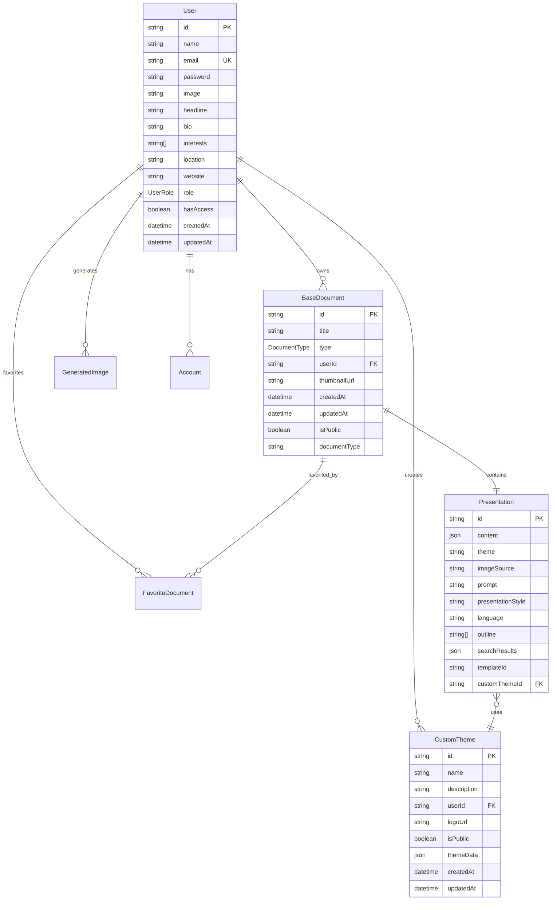

[根目录](../../CLAUDE.md) > **prisma**

# Prisma数据库模块

## 模块职责

`prisma` 目录负责数据持久化层，包含：
- 数据库模式定义
- 数据迁移脚本
- 类型安全的数据库操作
- 关系映射和约束

## 入口与启动

### 核心文件
- `schema.prisma` - 数据库模式定义
- `migrations/` - 数据库迁移历史

### 数据库配置
```prisma
datasource db {
  provider = "postgresql"
  url      = env("DATABASE_URL")
}
```

## 数据模型架构

### 核心实体关系图



## 数据模型详解

### 用户系统 (User Management)

#### User 模型
```prisma
model User {
    id            String    @id @default(cuid())
    name          String?
    email         String?   @unique
    password      String?
    emailVerified DateTime?
    image         String?
    createdAt     DateTime  @default(now())
    updatedAt     DateTime  @default(now()) @updatedAt
    headline      String?   @db.VarChar(100)
    bio           String?   @db.Text
    interests     String[]
    location      String?
    website       String?
    accounts      Account[]
    role          UserRole  @default(USER)
    hasAccess     Boolean   @default(false)

    // 关联关系
    documents       BaseDocument[]
    favorites       FavoriteDocument[]
    CustomTheme     CustomTheme[]
    GeneratedImage  GeneratedImage[]
}
```

#### Account 模型 (NextAuth集成)
```prisma
model Account {
    id                       String  @id @default(cuid())
    userId                   String
    type                     String
    provider                 String
    providerAccountId        String
    refresh_token            String?
    access_token             String?
    expires_at               Int?
    token_type               String?
    scope                    String?
    id_token                 String?
    session_state            String?
    user                     User    @relation(fields: [userId], references: [id])

    @@unique([provider, providerAccountId])
}
```

### 文档系统 (Document System)

#### BaseDocument 模型
```prisma
model BaseDocument {
    id           String        @id @default(cuid())
    title        String
    type         DocumentType
    userId       String
    user         User          @relation(fields: [userId], references: [id])
    thumbnailUrl String?
    createdAt    DateTime      @default(now())
    updatedAt    DateTime      @updatedAt
    isPublic     Boolean       @default(false)
    documentType String
    presentation Presentation?
    favorites    FavoriteDocument[]
}

enum DocumentType {
    NOTE
    DOCUMENT
    DRAWING
    DESIGN
    STICKY_NOTES
    MIND_MAP
    RAG
    RESEARCH_PAPER
    FLIPBOOK
    PRESENTATION
}
```

### 演示文稿系统 (Presentation System)

#### Presentation 模型
```prisma
model Presentation {
    id                String       @id @default(cuid())
    content           Json         // 幻灯片内容，包含主题等
    theme             String       @default("default")
    imageSource       String       @default("ai")
    prompt            String?      // 用户原始提示
    presentationStyle String?      // 演示风格
    language          String?      @default("en-US")
    outline           String[]     // 大纲内容
    searchResults     Json?        // 搜索结果
    base              BaseDocument @relation(fields: [id], references: [id], onDelete: Cascade)
    templateId        String?
    customThemeId     String?
    customTheme       CustomTheme? @relation(fields: [customThemeId], references: [id])
}
```

### 主题系统 (Theme System)

#### CustomTheme 模型
```prisma
model CustomTheme {
    id          String   @id @default(cuid())
    name        String
    description String?
    userId      String
    user        User     @relation(fields: [userId], references: [id], onDelete: Cascade)
    logoUrl     String?
    isPublic    Boolean  @default(false)
    createdAt   DateTime @default(now())
    updatedAt   DateTime @updatedAt
    themeData   Json     // 完整主题配置
    presentations Presentation[]

    @@index([userId])
}
```

### 辅助系统 (Auxiliary Systems)

#### FavoriteDocument 模型
```prisma
model FavoriteDocument {
    id         String       @id @default(uuid())
    documentId String
    document   BaseDocument @relation(fields: [documentId], references: [id], onDelete: Cascade)
    userId     String
    user       User         @relation(fields: [userId], references: [id])
}
```

#### GeneratedImage 模型
```prisma
model GeneratedImage {
    id        String   @id @default(cuid())
    url       String
    createdAt DateTime @default(now())
    updatedAt DateTime @updatedAt
    userId    String
    user      User     @relation(fields: [userId], references: [id], onDelete: Cascade)
    prompt    String
}
```

## 数据库操作模式

### 常用查询模式

#### 用户相关查询
```typescript
// 获取用户及其演示文稿
const userWithPresentations = await db.user.findUnique({
  where: { id: userId },
  include: {
    documents: {
      where: { type: 'PRESENTATION' },
      include: { presentation: true }
    }
  }
});

// 获取用户自定义主题
const userThemes = await db.customTheme.findMany({
  where: { userId },
  orderBy: { createdAt: 'desc' }
});
```

#### 演示文稿查询
```typescript
// 创建演示文稿
const presentation = await db.baseDocument.create({
  data: {
    type: 'PRESENTATION',
    documentType: 'presentation',
    title: title,
    userId,
    presentation: {
      create: {
        content: content,
        theme: theme,
        outline: outline,
      }
    }
  },
  include: { presentation: true }
});

// 搜索演示文稿
const presentations = await db.baseDocument.findMany({
  where: {
    userId,
    type: 'PRESENTATION',
    title: { contains: searchTerm }
  },
  include: { presentation: true }
});
```

## 索引和性能

### 已定义索引
```prisma
// CustomTheme表的用户ID索引
@@index([userId])

// Account表的唯一索引
@@unique([provider, providerAccountId])
```

### 建议添加的索引
```sql
-- 演示文稿查询优化
CREATE INDEX idx_base_document_user_type ON "BaseDocument"(userId, type);
CREATE INDEX idx_base_document_created_at ON "BaseDocument"(createdAt DESC);

-- 用户查询优化
CREATE INDEX idx_user_email ON "User"(email);
CREATE INDEX idx_user_has_access ON "User"(hasAccess);

-- 收藏查询优化
CREATE INDEX idx_favorite_user_document ON "FavoriteDocument"(userId, documentId);
```

## 数据迁移

### 迁移命令
```bash
# 生成迁移文件
npx prisma migrate dev --name <migration_name>

# 应用迁移
npx prisma migrate deploy

# 重置数据库
npx prisma migrate reset

# 推送模式更改(开发环境)
npx prisma db push
```

### 迁移文件结构
```
prisma/migrations/
├── migration_lock.toml
└── 20240101000000_init/
    ├── migration.sql
    └── README.md
```

## 数据完整性

### 外键约束
- 所有关系模型都有适当的外键约束
- 使用 `onDelete: Cascade` 确保数据一致性
- 用户删除时级联删除相关数据

### 数据验证
- 使用 `@db.VarChar(100)` 限制字段长度
- 枚举类型确保数据有效性
- 必需字段使用 `@default` 提供默认值

## 测试与质量

**当前测试状态**: 无数据库测试

**建议测试策略**:
1. **单元测试**: 测试数据模型和基本CRUD操作
2. **集成测试**: 测试复杂查询和事务
3. **性能测试**: 测试大数据量下的查询性能
4. **数据完整性测试**: 验证约束和级联删除

**测试工具**:
- Jest + Supertest
- Prisma Test Client
- 数据库 seeding 脚本

## 备份和恢复

### 备份策略
```bash
# PostgreSQL备份
pg_dump -h localhost -U username -d database_name > backup.sql

# 压缩备份
pg_dump -h localhost -U username -d database_name | gzip > backup.sql.gz
```

### 恢复策略
```bash
# 从备份恢复
psql -h localhost -U username -d database_name < backup.sql

# 从压缩备份恢复
gunzip -c backup.sql.gz | psql -h localhost -U username -d database_name
```

## 常见问题 (FAQ)

### Q: 如何添加新的文档类型？
A: 在 `DocumentType` 枚举中添加新类型，并更新相关业务逻辑。

### Q: 如何处理演示文稿内容的版本控制？
A: 考虑添加 `PresentationVersion` 模型来跟踪内容变更历史。

### Q: 如何优化大量演示文稿的查询性能？
A: 添加复合索引，实现分页查询，考虑使用缓存。

## 扩展建议

### 短期改进
1. **添加软删除**: 为主要模型添加 `deletedAt` 字段
2. **审计日志**: 记录重要数据变更
3. **性能监控**: 添加查询性能跟踪

### 长期扩展
1. **全文搜索**: 集成PostgreSQL的全文搜索
2. **数据分区**: 按时间或用户分区大表
3. **读写分离**: 实现主从数据库架构

## 相关文件清单

### 核心文件
- `schema.prisma` - 数据库模式定义
- `migrations/` - 数据库迁移文件

### 配置文件
- `.env` - 数据库连接配置
- `package.json` - Prisma依赖版本

### 脚本文件
- `scripts/db-seed.ts` - 数据库种子数据(如果存在)

## 变更记录 (Changelog)

**2025-11-17 23:56:24** - 初始化数据库文档
- 分析了完整的数据模型
- 绘制了实体关系图
- 识别了性能优化机会
- 建议了测试和备份策略