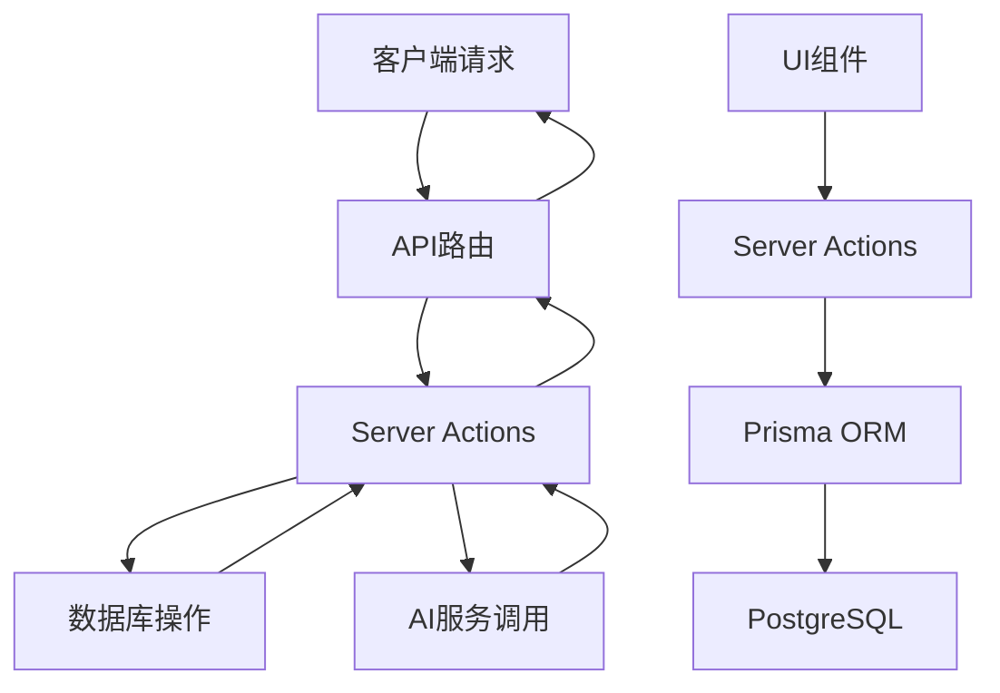

[根目录](../../../CLAUDE.md) > **app**

# App模块 - Next.js应用路由

## 模块职责

`src/app` 目录是Next.js 13+ App Router的核心模块，负责：
- 应用路由和页面定义
- API端点实现
- 服务端操作(Server Actions)
- 全局布局和元数据配置

## 入口与启动

### 主要入口文件
- `layout.tsx` - 根布局组件，配置全局Provider
- `page.tsx` - 首页组件(当前为默认Next.js页面)

### 布局结构
```typescript
// layout.tsx
<QueryProvider>
  <AuthProvider>
    <ThemeProvider>
      {children}
    </ThemeProvider>
  </AuthProvider>
</QueryProvider>
```

## 对外接口

### API路由

| 路径 | 方法 | 功能 | 状态 |
|------|------|------|------|
| `/api/auth/[...nextauth]` | ALL | NextAuth.js认证 | 生产就绪 |
| `/api/presentation/generate` | POST | 生成演示文稿内容 | 核心功能 |
| `/api/presentation/outline` | POST | 生成演示文稿大纲 | 核心功能 |
| `/api/presentation/outline-with-search` | POST | 带搜索的大纲生成 | 高级功能 |
| `/api/uploadthing` | POST | 文件上传处理 | 完整 |

### 核心API实现

#### 演示文稿生成 API
```typescript
// api/presentation/generate/route.ts
interface SlidesRequest {
  title: string;
  prompt: string;
  outline: string[];
  language: string;
  tone: string;
  modelProvider?: string;
  modelId?: string;
  searchResults?: Array<{query: string; results: unknown[]}>;
}
```

**特性**:
- 支持多种AI模型(OpenAI, Ollama, LM Studio)
- 流式响应实现
- 多种布局模板
- 图像生成集成

## 关键依赖与配置

### Server Actions
位于 `_actions/` 目录，负责服务端业务逻辑：

#### 演示文稿操作
- `presentationActions.ts` - 演示文稿CRUD操作
- `theme-actions.ts` - 主题管理
- `fetchPresentations.ts` - 演示文稿查询
- `exportPresentationActions.ts` - 导出功能
- `sharedPresentationActions.ts` - 共享操作

#### 图像操作
- `image/generate.ts` - AI图像生成
- `image/unsplash.ts` - Unsplash图片获取

### 环境配置
通过 `../env.js` 统一管理环境变量：
```typescript
export const env = createEnv({
  server: {
    DATABASE_URL: z.string().url(),
    OPENAI_API_KEY: z.string(),
    // ... 其他配置
  }
});
```

## 页面路由结构

```
src/app/
├── layout.tsx              # 根布局
├── page.tsx               # 首页
├── loading.tsx            # 加载状态
├── globals.css            # 全局样式
├── auth/                  # 认证页面
│   ├── signin/
│   └── signout/
├── presentation/          # 演示文稿页面
│   ├── page.tsx          # 演示文稿列表
│   ├── layout.tsx        # 演示文稿布局
│   ├── [id]/             # 演示文稿详情
│   └── generate/[id]/    # 生成页面
├── api/                  # API路由
│   ├── auth/
│   ├── presentation/
│   └── uploadthing/
└── _actions/             # Server Actions
    ├── presentation/
    └── image/
```

## 数据流架构



## 测试与质量

**当前测试状态**: 无测试覆盖

**建议测试策略**:
1. **API路由测试**: 测试所有端点的请求/响应
2. **Server Actions测试**: 测试服务端业务逻辑
3. **集成测试**: 测试完整的API流程
4. **认证测试**: 测试登录/登出流程

**推荐工具**:
- Jest + Supertest (API测试)
- Next.js内置测试工具

## 常见问题 (FAQ)

### Q: 如何添加新的API端点？
A: 在 `src/app/api/` 下创建对应目录的 `route.ts` 文件，遵循Next.js 13+ App Router约定。

### Q: Server Actions与API路由的选择？
A:
- **Server Actions**: 用于组件直接调用的服务端操作
- **API路由**: 用于外部客户端调用的HTTP接口

### Q: 如何处理AI模型的流式响应？
A: 参考 `/api/presentation/generate/route.ts` 中的 `streamText` 实现。

## 性能考虑

1. **缓存策略**: 对AI响应实施适当缓存
2. **请求限制**: 实施API调用频率限制
3. **数据库优化**: 使用适当的索引和查询优化
4. **流式响应**: 对长时间运行的AI操作使用流式传输

## 安全要点

1. **输入验证**: 所有API输入需要验证
2. **认证授权**: 确保用户只能访问自己的数据
3. **API密钥保护**: 安全存储和使用AI服务密钥
4. **文件上传**: 实施文件类型和大小限制

## 相关文件清单

### 核心文件
- `layout.tsx` - 应用根布局
- `page.tsx` - 首页
- `loading.tsx` - 全局加载组件

### API路由
- `api/auth/[...nextauth]/route.ts` - 认证API
- `api/presentation/generate/route.ts` - 演示文稿生成
- `api/presentation/outline/route.ts` - 大纲生成
- `api/uploadthing/route.ts` - 文件上传

### Server Actions
- `_actions/presentation/presentationActions.ts` - 演示文稿操作
- `_actions/presentation/theme-actions.ts` - 主题管理
- `_actions/image/generate.ts` - 图像生成

### 页面组件
- `presentation/page.tsx` - 演示文稿列表页
- `presentation/[id]/page.tsx` - 演示文稿详情页
- `auth/signin/page.tsx` - 登录页面

## 变更记录 (Changelog)

**2025-11-17 23:56:24** - 初始化文档创建
- 分析了完整的API路由结构
- 识别了Server Actions的组织方式
- 记录了主要的功能模块