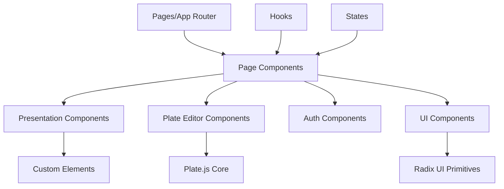

[根目录](../../../CLAUDE.md) > **components**

# Components模块 - React组件库

## 模块职责

`src/components` 目录包含所有React组件，主要负责：
- 演示文稿相关UI组件
- Plate.js富文本编辑器配置
- 用户认证组件
- 通用UI组件库
- 全局状态和上下文

## 入口与启动

### 主要组件分类
- `presentation/` - 演示文稿核心组件
- `plate/` - 富文本编辑器组件
- `auth/` - 认证相关组件
- `ui/` - 通用UI组件
- `globals/` - 全局组件和配置

## 对外接口

### 演示文稿组件 (presentation/)

#### 仪表板组件
| 组件 | 路径 | 功能 |
|------|------|------|
| `PresentationDashboard` | `dashboard/PresentationDashboard.tsx` | 主仪表板界面 |
| `PresentationInput` | `dashboard/PresentationInput.tsx` | 演示文稿输入表单 |
| `ModelPicker` | `dashboard/ModelPicker.tsx` | AI模型选择器 |
| `PresentationExamples` | `dashboard/PresentationExamples.tsx` | 示例演示文稿 |
| `RecentPresentations` | `dashboard/RecentPresentations.tsx` | 最近演示文稿列表 |

#### 编辑器组件
| 组件 | 路径 | 功能 |
|------|------|------|
| 自定义元素 | `editor/custom-elements/` | 50+种幻灯片元素类型 |
| 拖拽功能 | `editor/dnd/` | 幻灯片拖拽重排 |
| 静态版本 | `editor/custom-elements/static/` | 展示版本组件 |

#### 自定义元素类型
```typescript
// 主要自定义元素类型
- presentation-heading-element.tsx      // 标题元素
- presentation-paragraph-element.tsx     // 段落元素
- presentation-image-element.tsx         // 图像元素
- presentation-table-node.tsx            // 表格元素
- bar-graph.tsx                          // 柱状图
- pie-chart.tsx                          // 饼图
- line-graph.tsx                         // 折线图
- area-chart.tsx                         // 面积图
- radar-chart.tsx                        // 雷达图
- scatter-plot.tsx                       // 散点图
- pyramid.tsx                            // 金字塔图
- staircase.tsx                          // 阶梯图
- cycle-element.tsx                      // 循环图
- arrow-list.tsx                         // 箭头列表
- icon-list.tsx                          // 图标列表
- pros-cons.tsx                          // 优缺点对比
- before-after.tsx                       // 前后对比
- compare.tsx                            // 比较图
```

### Plate编辑器组件 (plate/)

#### 插件系统
| 插件类型 | 功能 | 状态 |
|----------|------|------|
| AI插件 | AI内容生成 | 完整 |
| 基础节点 | 段落、标题等 | 完整 |
| 列表插件 | 有序/无序列表 | 完整 |
| 表格插件 | 表格编辑 | 完整 |
| 链接插件 | 链接管理 | 完整 |
| 图像插件 | 图像插入和编辑 | 完整 |
| 数学公式 | LaTeX数学公式 | 完整 |
| Markdown支持 | Markdown语法 | 完整 |
| 代码块 | 代码高亮 | 完整 |
| 评论功能 | 协作评论 | 完整 |

#### 编辑器配置
```typescript
// editor-kit.tsx - 主要编辑器配置
const plugins = [
  aiKit,
  basicBlocksKit,
  basicMarksKit,
  listKit,
  tableKit,
  linkKit,
  mediaKit,
  mathKit,
  // ... 更多插件
];
```

### 认证组件 (auth/)
- `Dropdown.tsx` - 用户菜单下拉
- `auth-button-components.tsx` - 认证按钮组件

### 通用UI组件 (ui/)
基于Radix UI构建的组件库，包含：
- 按钮、输入框、选择器等基础组件
- 对话框、抽屉、弹出框等交互组件
- 数据展示组件

## 关键依赖与配置

### 主要依赖
```json
{
  "@platejs/*": "富文本编辑器",
  "@radix-ui/*": "UI基础组件",
  "@dnd-kit/*": "拖拽功能",
  "framer-motion": "动画效果",
  "recharts": "图表组件",
  "lucide-react": "图标库"
}
```

### 样式系统
- **Tailwind CSS**: 主要样式框架
- **Radix UI**: 无样式可访问组件
- **自定义主题**: 支持亮/暗模式切换

## 组件架构设计

### 分层架构


### 组件通信模式
1. **Props传递**: 父子组件数据传递
2. **Context**: 全局状态(主题、认证等)
3. **自定义Hooks**: 复杂状态逻辑封装
4. **Zustand**: 跨组件状态管理

## 状态管理

### 主要状态
- **演示文稿状态**: 当前编辑的演示文稿数据
- **用户状态**: 登录用户信息
- **主题状态**: UI主题(亮/暗模式)
- **编辑器状态**: Plate编辑器状态

### 状态管理工具
- **React Context**: 全局状态
- **Zustand**: 跨组件状态
- **Server Actions**: 服务端状态同步

## 测试与质量

**当前测试状态**: 无组件测试

**建议测试策略**:
1. **单元测试**: 测试组件的渲染和交互
2. **快照测试**: 确保UI一致性
3. **可访问性测试**: 使用testing-library测试可访问性
4. **集成测试**: 测试组件组合和用户流程

**推荐工具**:
- React Testing Library
- Jest
- Storybook (组件文档)

## 性能优化

### 已实现优化
- **代码分割**: 动态导入大型组件
- **组件懒加载**: 减少初始Bundle大小
- **图像优化**: Next.js Image组件集成

### 建议优化
1. **虚拟化**: 大列表组件虚拟化
2. **记忆化**: React.memo和useMemo优化
3. **Bundle分析**: 监控组件大小

## 可访问性

### 实现功能
- **键盘导航**: 支持Tab键导航
- **屏幕阅读器**: 适当的ARIA标签
- **颜色对比**: 符合WCAG标准
- **焦点管理**: 清晰的焦点指示

### 工具
- Radix UI内置可访问性
- 自定义钩子管理焦点

## 常见问题 (FAQ)

### Q: 如何创建新的自定义元素？
A: 在 `src/components/presentation/editor/custom-elements/` 下创建新组件，并在解析器中注册。

### Q: Plate编辑器如何集成自定义插件？
A: 参考 `src/components/plate/plugins/` 中的现有插件，使用Plate.js的插件API。

### Q: 拖拽功能如何实现？
A: 使用 `@dnd-kit` 库，在 `editor/dnd/` 目录中实现拖拽逻辑。

## 相关文件清单

### 演示文稿组件
```
presentation/
├── dashboard/           # 仪表板相关组件
├── editor/             # 编辑器组件
│   ├── custom-elements/ # 自定义元素
│   ├── dnd/           # 拖拽功能
│   └── native-elements/ # 原生元素
├── theme/             # 主题组件
├── outline/           # 大纲编辑组件
└── utils/             # 演示文稿工具
```

### Plate编辑器组件
```
plate/
├── plugins/           # 编辑器插件
├── hooks/            # 编辑器钩子
├── ui/               # 编辑器UI组件
├── lib/              # 编辑器库文件
└── utils/            # 编辑器工具
```

### 其他组件
```
auth/                 # 认证组件
globals/             # 全局组件
ui/                  # 通用UI组件
```

## 变更记录 (Changelog)

**2025-11-17 23:56:24** - 初始化组件文档
- 分析了50+自定义元素类型
- 记录了Plate编辑器插件系统
- 识别了组件架构模式
- 发现了测试覆盖缺口